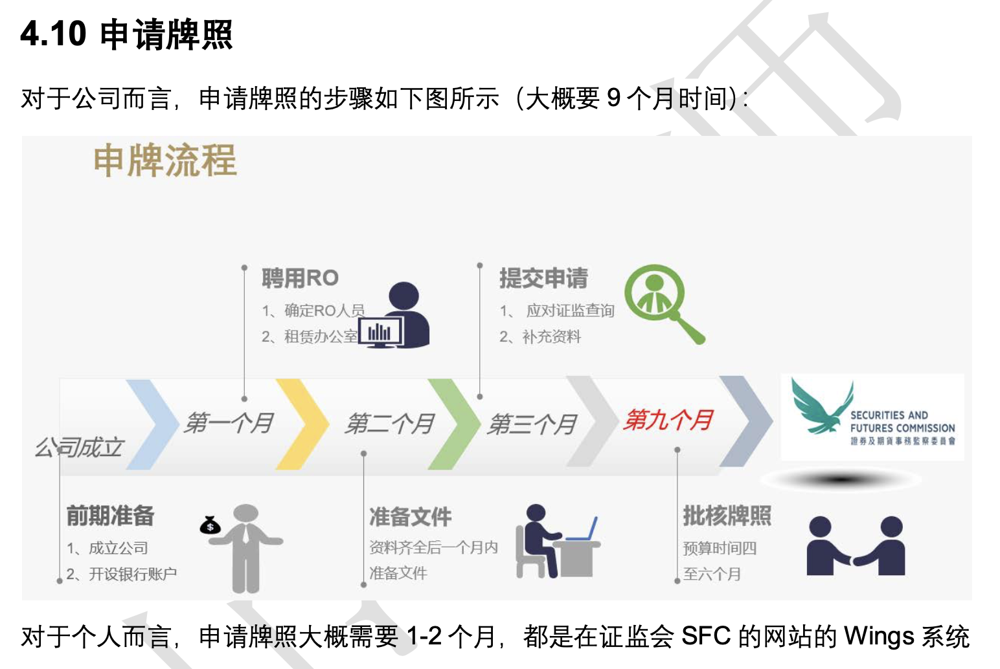

# HKSI 卷6 Review 1：第1-4章重整版（按考点展开）

## 目录
- 1 一般监管架构
  - 1.1 监管机构一般采用的方式
  - 1.2 证监会的使命与国际合作
  - 1.3 证监会的监管理念
  - 1.4 金管局的角色
  - 1.5 积金局的职能
  - 1.6 保监局的职能
  - 1.7 行业背景
  - 1.8 为什么要监管
- 2 法律及法规架构
  - 2.1 适用于资产管理业的主要条例
  - 2.2 证监会的监管责任
  - 2.3 持牌及注册的规定
  - 2.4 SFO 对“提供资产管理”的定义
  - 2.5 集体投资计划的认可
  - 2.6 结构性产品的认可
  - 2.7 广告及邀请
  - 2.8 失实陈述
  - 2.9 开放式基金型公司（OFC）
  - 2.10 守则及指引的法律地位
- 3 监管机构
  - 3.1 证监会的角色
  - 3.2 证监会的组织结构
  - 3.3 证监会主要部门（高频）
  - 3.4 监管事务委员会
  - 3.5 香港金融管理局
  - 3.6 香港交易及结算所有限公司
  - 3.7 强制性公积金计划管理局
  - 3.8 保险业监管局
  - 3.9 监管机构间的关系
- 4 《证券及期货条例》下的中介人发牌及注册规定
  - 4.1 所涉人士的一般身份
  - 4.2 资产管理人的发牌要求
  - 4.3 代表客户投资的交易商
  - 4.4 私募股本公司
  - 4.5 家族办公室
  - 4.6 从事虚拟资产业务的分销商及基金经理
  - 4.7 其他人士
  - 4.8 负责人员（RO）
  - 4.9 认可财务机构、注册机构、持牌法团
  - 4.11 适当人选的指引
  - 4.12 持续培训 CPT 的要求
- 5 《操守准则》
  - 5.1 颁布
  - 5.2 适用范围
  - 5.3 九项一般原则
  - 5.4 非中央结算场外衍生工具保证金规定（5.128-5.140）
  - 5.5 专业投资者（定义、分类及豁免条文）
- 6 《内部监控指引》
  - 6.1 目的与范围
  - 6.2 主要监控范畴
- 7 个人资料
  - 7.1 《个人资料（私隐）条例》
  - 7.2 六项保障资料原则
- 8 防止洗钱及恐怖分子资金筹集
  - 8.1 特别组织与联合财富情报组
  - 8.2 相关法例与证监会法规
  - 8.3 风险为本方法与可疑交易识别
  - 8.4 第三者参与与跨境代理关系
  - 8.5 联合财富情报组建议披露程序
  - 8.6 自我评估、培训、国际性考虑
  - 8.7 洗钱阶段与受监管活动应用
  - 8.8 风险评估与复核要求
- 9 纪律处分
  - 9.1 持牌或注册的条件限制
  - 9.2 《证监会纪律处分罚款指引》
  - 9.3 公众纪录册
- 10 企业管治及监管
- 11 积金局及保监局的法规及监管

## 1 一般监管架构

### 1.1 监管机构一般采用的方式
- 香港资产管理业主要监管机构：
    - 证监会（SFC），负责证券及期货行业监管
    - 金管局（HKMA），负责监管依据《银行业条例》获得认可的机构，并对这些机构开展《证券及期货条例》相关业务的日常一线监管。

### 1.2 证监会的使命与国际合作
- 证监会使命：加强及维护香港证券及期货市场的廉洁稳健，保障投资者及业界利益。
- 证监会会参与国际证券事务，并与国际证监组织合作，推动与国际接轨的监管制度。

### 1.3 证监会的监管理念
- 证监会强调：监管要严谨，但不应阻碍市场发展。
- 证监会设定最低监管标准，同时要求业界自行审慎管理风险。
- 证监会不是要消灭全部商业风险，也不会替代中介人管理层承担责任，更不会保证中介人不会倒闭。
- 证监会做法是提供适度保障，并重视透明度与市场沟通。

### 1.4 金管局的角色
- 金管局是香港中央银行机构，也是香港政府的金融监管机构。
- 主要职责：制定 执行金融政策、维护金融稳定 公平 金融发展。
- 金管局与证监会签有谅解备忘录，协同监管从事资产管理业务的认可财务机构。
- 在香港从事基金经理业务，需要由证监会发牌或注册
- 注册机构由金管局负责一线监管。

### 1.5 积金局的职能
- 积金局负责监管、监督和监察强积金计划运作，确保遵守《强积金条例》。

 - 🔥 积金局负责：
  - 注册强积金计划。（批准强积金计划） 
  - 批准该计划的🔥受托人及🔥保管人。（批准受托人和保管人） 
  - 就有关计划从事销售、市场推广或提供建议的中介人进行注册管理。（注册强积金计划中介人） 
 
- 受托人负责管理、行政 
- 保管人负责托管资金，结算。 
 
- 证监会负责批准：强积金销售文件 市场推广资料。 

### 1.6 保监局的职能
- 保监局🔥独立于政府，负责监管及监察香港保险业。
- 覆盖职能包括：发牌、监察、调查和纪律制裁。

### 行业背景
- 资产管理行业监管范围：
    - 产品（如集体投资计划产品）
    - 服务提供者
    - 中介人
    - 投资者。

 中产投服

- 市场参与者：
    - 基金管理公司
    - 经纪
    - 银行
  
 基经银

### 1.8 为什么要监管
- 维持市场秩序、竞争性与效率，
- 降低管理风险并保护投资者。

资产管理业监管架构的几个组织：证监会 金管局 积 保

## 2 法律及法规架构

### 2.1 适用于资产管理业的主要条例
- 主要法例是《证券及期货条例》（SFO）。
- 配套法例常见有《银行业条例》《强积金条例》《受托人条例》。

### 2.2 证监会的监管责任
- 证监会监管香港证券及期货行业，并向中介人（机构）及其代表（个人）发牌。
- 香港资产管理业涉及大量公众资金，证监会主要目标是确保市场有秩序、具竞争、有效率地运作。
- 认可集体投资计划，公众发售集体投资计划，房地产基金，在面向公众卖基金前，先过证监会这关，再按证监会规则卖。
- ⭐️ 监管难点：从事管理、经营或持有相关资产的人士经常不在香港，增加执行 SFO 授权监管时的跨境难度。

### 2.3 持牌及注册的规定
- 香港实行单一发牌制度：由 SFC 发牌，牌照可覆盖一类或多类受监管活动。
- 法团从事受监管活动必须获得证监会发牌。
- 认可财务机构如拟从事一类或多类受监管活动，必须向证监会注册为“注册机构”。
- 注册机构从事 SFO 活动时由金管局与证监会共同监管：
  - 金管局是一线监管机构。
  - 证监会是行业主要监管机构。

### 2.4 SFO 对“提供资产管理”的定义
- 包括房地产 证券 期货投资管理。

### 2.5 2.6 集体投资计划的认可
- 证监会可授予“集体投资计划”，“结构性产品”认可地位。
- 获认可后，方可按规定向香港公众发售。

### 2.7 广告及邀请
- 核心原则：凡诱使公众投资的广告，不可有虚假陈述或误导成分。
- 一般规则：广告必须经证监会认可，或属于法定豁免，才可发出；否则可能构成罪行。
- 🔥 法定豁免（考试高频，建议整组记忆）：
  - (a) 招股章程已属法定豁免，不用按《公司清盘及杂项条文条例》走完整套招股章程合规流程。

  - (b) 与 已获认可交易所上市证券 相关的上市文件，以及部分拟发售文件。
  
  - (c) 由持牌法团发出的广告、邀请或文件：
    - 如属证券发出，相关法团必须持1/4/6牌其中之一。
    - 如属期货发出，相关法团必须持2/5牌其中之一。

  - (d) 就证券或集体投资计划权益发出的广告，该证券权益只转让专业投资者。

- 出版及传播免责：在日常业务中刊登该类广告的报章卖方/出版商、通讯机构、广播者，可以豁免责任。

### 2.8 失实陈述
- 投资广告受监管，禁止欺诈或罔顾实情的失实陈述。
- 违规会：
    - 触发民事补救
    - 触发刑事制裁。

### 2.9 开放式基金型公司（OFC）
- OFC 是投资载体（SPV），不用于一般实体经营。
- 证监会负责 OFC 的注册、取消注册等监管事宜。
- 设立流程要点：
    - 证监会review载有指明详细资料的申请
    - 公司注册处处长走公司注册程序
  
- OFC 名称必须以“开放式基金型公司”或“OFC”结尾。
- OFC 可发行多个类别股份；各类别权利按法团成立文书规定。

- ⭐️ OFC总表决权超10%的股东可要求：
    - 召开股东大会
    - 要求公司把某个议题正式放进股东大会的会议安排里，让全体股东在会上讨论和表决。

- OFC保管人
  - 🔥 OFC保管人的委任，董事须先向证监会取得事先批准。
  - 保管人离任（辞任、终止职务、被替换）须披露任何应让股东/债权人知道的事，并向证监会提交披露文本。

- OFC核数师
  - 每间 OFC 必须委任核数师；核数师可查阅会计记录，并向高级人员、保管人或会计记录负责人查询。

- OFC投资经理
  - OFC 必须委任投资经理；如果委任多名投资经理，至少一名必须持有第9类（资产管理）牌照或完成相关注册。

### 2.10 守则及指引的法律地位
- 证监会守则及指引本身不具“法例”地位：既非主体法例，也非附属法例。
- 只因违反守则/指引本身，不当然构成违法。
- 但在根据 SFO 进行的法院程序中，守则/指引可被纳为证据，并可用于裁定相关问题。

## 3 监管机构

### 3.1 证监会的角色
- 证监会是独立法定组织，不属于政府，也不由政府发薪。
- 金管局是政府的组织，财政司司长是老大
- SFO 订明其监管目标、职能、权力和一般责任。

### 3.2 证监会的组织结构
- 董事局由非执行主席、行政总裁等组成，非执行董事组成
- 成员由行政长官（或经授权的财政司司长）委任。

### 3.3 证监会主要部门（高频）
- 主要部门：
  - 投资产品部（产品）
  - 中介机构部（牌照）
  - 市场监察部（管市场）
  - 企业融资部（管上市并购）
  - 法规执行部（执法）

- 投资产品部：
  - 监管及认可向公众发售的投资产品。
  - 注册开放式基金型公司（OFC）。
  - 监察认可产品及已注册 OFC 的披露和持续合规。
  - 发展监管平台，促进市场发展及产品创新。

- 中介机构部：包括发牌科及中介团体监察科。
  - 负责执行发牌规定。
  - 持续监督持牌法团和持牌人士，重点看业务操守及财务健全性。

  - 发牌科：
    - 向拟在香港经营、且依法必须持牌的受监管业务机构和个人“发牌”。
    - 就持续持牌者需遵守的胜任能力、适合性要求，“发出守则指引”。
    - 决定持牌法团/人是否继续持牌。

  - 中介团体监察科：
    - 持续监察持牌法团及个人。监管方式包括实地视察和非实地监察。

- 市场监察部：
  - ⭐️ 监管香港交易所运作。
  - ⭐️ 认可自动化交易服务。
  - ⭐️ 加强与内地及国际市场联系。
  - ⭐️ 监督及管理投资者赔偿基金。
  - 制订政策，促进市场基础设施发展
  - 协调市场紧急应变计划。

- 企业融资部：
  - ⭐️ 与联交所共同审批上市申请。
  - ⭐️ 监督联交所职能（与上市事务有关的事）。
  - ⭐️ 监察上市公司公告，识别失当行为或不合规情况。
  - 执行《公司收购、合并及股份回购守则》。

  - 按《证券及期货（在证券市场上市）规则》行使权力，及早介入上市申请和企业交易中的严重失当个案。

- 法规执行部：
  - ⭐️ 监察市场不规范交易及可能的市场失当行为。
  - ⭐️ 调查涉嫌违反 SFO 及守则的行为。
  - ⭐️ 审查怀疑涉及不当行为的上市公司。
  - 在有需要时，与本地和海外执法机构及监管机构合作调查。

### 3.4 监管事务委员会
- 证监会设立多个委员会，提供咨询和建议；部分为独立机构，部分用于制衡。
- 与资产管理相关重点：
  - 产品咨询委员会：就产品相关事项提供意见，证监会保留认可产品、发售文件及广告的最终权力。
  - 房地产投资信托基金委员会：就房地产基金守则、市场发展及实务指引向证监会提供建议。
  - 证券及期货事务上诉审裁处：根据 SFO 设立，负责审理对证监会特定决定的上诉（如发牌注册、上市申请相关权力行使等）。

### 3.5 香港金融管理局
- 负责监管银行业务及维护银行体系稳定。
- 对于依据《银行业条例》获得认可、并从事 SFO 活动的机构，必须就相关活动向证监会注册。
- 因此在该类机构监管上，金管局与证监会存在职能重叠。

### 3.6 香港交易及结算所有限公司
- 作为证监会认可的交易所控制人，负责旗下交易所公平有序运作。

### 3.7 强制性公积金计划管理局

注意，强积金计划管理局监管强积金“销售活动”。证监会监管强积金“销售活动的材料”

- 负责确保《强积金条例》获遵守，监管强积金制度。
- 其职能包括：
  - (a) 确保《强积金条例》获遵守。
  - (b) 注册强积金计划。
  - (c) 核准受托人及监管其事务及活动。
  - (d) 🔥 监管销售及推销活动，以及就强积金计划提供意见的活动。
  - (e) 就支付强制性供款及有效管理强积金计划订立规则及指引。
  - (f) 研究并建议有关《职业退休计划条例》或强积金法律改革。
  - (g) 促进及鼓励香港退休计划行业发展。
- 主要部门：
  - 成员保障及服务部
  - 监管部
  - 执法部
  - 产品监管部及政策发展及研究部
  - 对外事务部
  - 行政部
  - 资讯科技部
  - 风险管理课及法律事务处

- 主要了解以下两个部门：  
  - 监管部职责：
    - 监管受托人的计划行政程序、营运、管治标准、服务提供者
    - 强积金中介人的注册，监管，培训教育。
  - 执法部职责：处理受托人及服务提供者涉嫌违反《强积金条例》的投诉、调查和检控。

### 3.8 保险业监管局
- 负责监管及监察保险业，保护保单持有人利益。
- 越来越多保险机构参与带保险/退休福利成分的集体投资计划，因此 IA、SFC、MPFA 在相关业务监管上会互有关联。

### 3.9 监管机构间的关系
- 各监管机构职能存在一定重叠，尤其在审慎监管中介人时。
- 为厘清监管边界，机构之间会签订谅解备忘录。

- 例子：资管公司发行某投资产品，且该产品已由 MPFA 注册/核准为强积金产品时：
  - SFC 负责：
    - ⭐️ 注册、核准及监管投资经理。
    - ⭐️ 监管提供强积金产品服务的投资顾问及证券交易商活动。
    - ⭐️ 调查涉嫌违反《证监会强积金产品守则》的行为，并在需要时执法。
  - MPFA 负责：
    - 监管强积金产品是否遵守《强积金条例》。
    - ⭐️ 监管,批准强积金产品受托人。
    - 调查强积金产品及受托人涉嫌违反《强积金条例》的行为。
    - ⭐️ 收集及调查公众投诉，并在需要时转介至证监会或其他监管机构。
  
强积金由MPFA的“强积金条例”一线监管。证监会二线监管

强积金产品由 MPFA 负责制度层面监管；但 SFC 依据产品守则及相关条例也会审查及认可推广资料，所以两者在实务上常出现并行审查。

## 4 《证券及期货条例》下的中介人发牌及注册规定

### 4.1 所涉人士的一般身份
- 常见参与者包括：
  - 资产管理人（通常涉第9类）
  - 分销商（通常涉第1类）
  - 交易商
  - 投资经理

### 4.2 资产管理人的发牌要求
- 从事资产管理活动必须获得证监会发牌或注册，核心是第9类受监管活动。
- 已获第9类牌照或注册的资产管理人，如仅为其所管理基金进行分销而从事第1类活动，可在条件满足时获豁免另取第1类牌照。

- 分销商如只做介绍业务、不持有客户资产、且不就介绍业务承担法律责任，可向证监会申请“核准介绍代理人”。

- 🔥 即使属“核准介绍代理人”，分销商仍必须持有第1类牌照，只是资本规定会明显降低。

### 4.3 代表客户投资的交易商
- 代表客户进行证券投资交易的交易商，必须就第1类受监管活动获发牌。

### 4.4 私募股本公司
- 私募股本公司从事资产管理时，通常需要按第9类牌照要求处理。

### 4.5 家族办公室
- 是否需要领牌要看实际设立方式与业务性质，不可一概而论。
- 可能是第9类，也可能涉及其他牌照类型，核心看“实际活动”。

### 4.6 从事虚拟资产业务的分销商及基金经理
- 证监会监管涉及虚拟资产的交易活动，相关业务必须遵守适用法例和规则。
- 虚拟资产可落入 SFO 与《打击洗钱条例》监管范围。
- 虚拟资产通常具备以下特征：
  - 以单位或价值作储存表达。（价值）
  - 可作为交易媒介（交）
  - 可作为权益。（权）
  - 可电子转移 储存 买卖。（转储买卖）
  - 具证监会订明的其他特征。（证监会规定）

价值权交 证监会可转

- 财经事务及库务局局长可指定某些数字形式价值是否属于虚拟资产。
- 被视为“虚拟资产基金经理”的持牌法团必须符合额外条款及条件。
- ⭐️ 认定门槛：
  - 投资组合目标是投资虚拟资产；或
  - 经理有意将该组合总资产价值的10%或以上投资于虚拟资产。

财经事务及库务局局长（FSTB局长）：政策局局长，负责财经事务及库务政策。
财政司司长（Financial Secretary）：更高层级的司长级官员，统筹整体财政及经济政策。

### 4.7 其他人士
- 还会涉及受托人、保管人、律师、会计师及投资顾问等专业人士。
- 投资顾问通常必须持第4类牌照。

- 认可集体投资计划必须委任香港代表与证监会对接。

### 4.8 负责人员（RO）
- 执行董事一定是 RO；
- RO 不一定是执行董事。
- 持牌代表通常是持牌机构的一般员工岗位。
- RO 是管理岗位，除持牌外还承担团队与业务管理职责。
- 🔥 公司层面高频点：每一类受监管活动通常至少要有2名 RO。
- 目前监管要求执行董事获批为 RO。

### 4.9 认可财务机构、注册机构、持牌法团
- 认可财务机构（Authorised Financial Institution）可理解为：
  - 持牌银行
  - 有限制牌照银行
  - 接受存款公司

- 注册机构（Registered Institution）：
  - 指开展证券牌照业务的银行。
  - 必须遵守证监会发出的守则和指引。
  - 注册机构通常不适用：
    - 《客户款项规则》客户 财政 账审
    - 《财政资源规则》
    - 《账目及审计规则》

- 持牌法团（Licensed Corporation）：
  - 非银行、非认可财务机构。
  - 经营证券期货业务并持有证监会牌照。
  - 常见例子：证券公司、期货公司、评级公司、基金公司、投行等。

- 三类认可财务机构的最低资本与存款限制：
  - 持牌银行：最低缴足资本3亿港元；可接受各类存款，无最低金额和最初存款期限制。
  - 有限制牌照银行：最低缴足资本1亿港元；仅可接受不少于50万港元的定期存款。
  - 接受存款公司：最低缴足资本2,500万港元；仅可接受不少于10万港元定期存款，且最初存款期不少于3个月。

  - 3125 5010 

### 4.10

开银行 - ro - 申牌

### 4.11 适当人选的指引

个人：财学经品年 
公司：财人内监 

两个指引：人选 能力

- 证监会会按严格标准评估申请人是否属于“适当人选”，核心看：财政状况、学历、经验、品格。财学经品
- 《适当人选的指引》同时适用于持牌机构和持牌个人。
- 个人申请人除了看《适当人选的指引》，还要结合《胜任能力的指引》；后者对个人要求更细。
- 个人申请人要满足年龄、经验、学历、财务资源状况（不是破产状态）要求，并具备良好品格和专业能力。
- 公司申请人要证明公司本身财务稳健、人员配置足够、内部监控系统有效。

### 4.12 持续培训 CPT 的要求
- 持牌人或注册人必须持续参与 CPT，保持专业能力与知识更新。
- 🔥 学时要求：持牌代表每年 10 小时；RO 每年 12 小时。

## 5 《证券及期货事务监察委员会持牌人或注册人操守准则》（《操守准则》）

### 5.1 操守准则的颁布
- 《操守准则》由证监会颁布，为持牌人或注册人从事受监管活动时提供行为标准。

### 5.2 操守准则的适用范围
- 《操守准则》适用于所有获发牌或注册的人士，包括法团和个人。

### 5.3 九项一般原则

勤诚高能利法（秦城高 能立法 客客客）

- ⭐️ 可以把这九项理解为：监管要求从业人员与机构必须同时达标的九个操守维度。
- (a) 诚实及公平：持牌人或注册人应以诚实、公平方式行事，维护客户最佳利益。
- (b) 勤勉尽责：持牌人或注册人应采取合理步骤，尽快执行客户交易指示。
- (c) 能力：持牌人或注册人应具备并有效运用所需资源和程序，适当经营业务。
- (d) 客户资料：持牌人或注册人应向客户索取财务状况、投资经验及投资目标资料。
- (e) 向客户提供资料：持牌人或注册人应在交易时向客户充分披露重要资料。
- (f) 利益冲突：若出现利益冲突，持牌人或注册人应确保客户获得公平对待。
- (g) 遵守法规：持牌人或注册人应遵守适用监管规定，维护市场廉洁稳健。
- (h) 客户资产：持牌人或注册人应妥善记账并保障客户资产。
- (i) 高级管理层责任：高级管理层应确保公司维持适当操守标准与合规程序。
- 🔥 考试易错点：违反《操守准则》本身不一定直接等于“违法”，但会影响“适当人选”资格，严重时可导致失去牌照或从业资格。

## 6 《内部监控指引》

### 6.1 内部监控指引的目的
- 目标是确保持牌人或注册人的业务运作有序、高效，并且守法合规。

### 6.2 内部监控指引的范围

管责人 资风控审察

监 - 架构
责 - 权责
人 - 培训
资 - 资料保存
风 - 管理风险
控 - 日常业务监控
审 - 独立评估内部审计
察 - 确保员工和证监会中介人守法

- 覆盖 8 个主要监控范畴：
  - 管理及监督
  - 责任及职能区分
  - 人事及培训
  - 资料管理
  - 监察事宜
  - 审计事宜
  - 运作监控
  - 风险管理

### 6.3 管理及监督
- 高级管理层应建立有效管理架构，确保业务高效率、有效运作。

### 6.4 责任及职能的区分
- 机构应划分互不相容的责任与职能，降低违规和舞弊风险。

### 6.5 人事及培训
- 机构应制定招聘和培训政策，确保员工遵守内部监控政策与程序。

### 6.6 资料管理
- 机构应确保业务资料和文件完整、保密、可靠。

### 6.7 监察事宜
- 机构应确保中介人及员工遵守适用法律、监管规定和内部政策。

### 6.8 审计事宜
- 机构应制定并实施审计政策，独立评估内部监控是否充分有效。

### 6.9 运作监控
- 机构应建立有效政策、程序与控制措施，支持日常业务运作。

### 6.10 风险管理
- 机构应建立并维持有效风险管理政策和程序，管理机构及客户相关风险。

## 7 个人资料

### 7.1 《个人资料（私隐）条例》
- 该条例用于保障个人资料私隐，适用于持牌法团或注册机构所控制的个人资料。

### 7.2 六项保障资料原则
- 1 合法目的：收集资料必须用于合法且不过度的目的，收集方式要合法及公平。
- 2 准确性及保留：资料应准确；当发现不准确时应更正；保存时间不得超过实现目的所需。
- 3 使用限制：🔥 未经资料当事人同意，个人资料不得改作新目的。
- 4 保安：个人资料必须受保护，防止未经授权或意外查阅、处理、删除、丧失或作其他用途。
- 5 政策公开：资料使用者应公开其隐私政策和实务，并说明所持资料类别与使用目的。
- 6 查阅及更正：
  - 资料当事人有权在合理时间内、支付合理费用后，⭐️ 查阅以清晰易懂形式记录的个人资料，并要求更正；
  - 如被拒绝，应获书面理由，并可向私隐专员提出异议。

## 8 防止洗钱及恐怖分子资金筹集

### 8.1 财务行动特别组织（特别组织）与联合财富情报组
- 财务行动特别组织（FATF）推动打击洗钱及恐怖分子资金筹集的法律、监管和营运标准。
- 香港联合财富情报组（JFIU）由香港警务处及香港海关人员组成。（警 关）
- 根据《贩毒（追讨得益）条例》《有组织及严重罪行条例》及《联合国反恐条例》，任何人发现可疑人士、交易或财产，有责任举报。
- 机构发现可疑交易后，应向联合财富情报组提交可疑交易报告。
- 处理时点：当发现疑似洗钱情形，应先评估是否需要披露，并与高级管理层紧急讨论，向客户进行适当质询及审阅相关资料。
- 紧急行动：如仍有疑虑并决定举报，应立即向联合财富情报组报告，必要时可电话处理。
- 持牌法团、持牌虚拟资产服务提供者或其有联系实体应保存披露完整记录（日期、披露人身份等）。
- ⭐️ 联合财富情报组会确认已收到可疑交易报告。
- 🔥 如果不需要立即采取行动，联合财富情报组一般会同意机构继续运作相关账户。
- 🔥 禁止“通知客户”：一旦已向联合财富情报组披露，机构、董事及雇员不得向客户发出通知或警告。

### 8.2 相关法例
- 常见 AML/CFT 相关法例包括《打击洗钱条例》《贩毒（追讨得益）条例》等。
- 反洗钱法例要求机构执行:
  - 客户尽职审查
  - 备存记录

### 8.3 证监会法规
- 证监会要求持牌法团和持牌虚拟资产服务提供者实施 AML/CFT 措施。

### 8.4 风险为本的方法
- 持牌法团和持牌虚拟资产服务提供者必须识别、管理并减低洗钱和恐怖分子资金筹集风险。

### 8.5 打击洗钱/恐怖分子资金筹集制度
- 制度应包括：合监管理安排、独立审核职能、雇员甄选程序、持续培训计划。

### 8.6 识别客户身份及风险状况
- 客户尽职审查应按客户类别采用不同核实方式（自然人或法人）。

### 8.7 持续监察
- 开户后，机构应持续监察账户活动，识别异常或可疑交易。

### 8.8 备存及保留纪录
- 机构应保存足够纪录，建立资金流向的审计线索。

### 8.9 交易监察
- 机构应建立系统和程序（例如大额交易特别报告）监察交易活动。

### 8.10 可疑交易的例子
- 无明显商业目的的交易。
- 以现金交收的大额或异常交易。
- 交易对手身份不明或资料不完整。
- 在同一账户频繁买卖同一只证券、制造“虚售交易”假象。
- 资金来自被称为制毒中心或贩毒中心地区。
- 账户长期持有大量闲置资金。
- 客户要求投资管理服务，但资金来源与其财务背景明显不符。
- 同一实益拥有人或受异常控制者开立多个账户。
- 多笔小额现金买入、一次性卖出，并把所得交给第三者。
- 以现金或不记名方式进行大额/异常交易。
- 销售人员业绩异常飙升、生活模式突变、客户使用转寄地址（如雇员或关联人士地址）等。

### 8.11 第三者的参与
- 第三者可理解为“看似代表客户行事的人”。
- 机构要求：
  - 核实第三者身份（标准不应低于核实客户本人）。
  - 核实第三者是否确有授权代表客户行事。
  - 制定经高级管理层批准的政策程序，管理通过第三者收付款或收取收益的风险。
  - 执行尽职审查、审查程序，并对使用第三者交易账户实施严格监控。

### 8.12 跨境代理关系
- 持牌法团及持牌虚拟资产服务提供者可为境外金融机构（受代理机构）提供服务。
- 客户尽职审查：机构应对受代理机构进行额外尽职审查，因为资料可能有限或不完整。
- 定期复核：应持续监控并定期复核通过代理关系取得的信息。
- 简化尽职审查：可在符合监管要求前提下，依赖集团层面 AML/CFT 政策，但必须确认其覆盖充分且有效降险。
- 集团层面监督：集团总部做反洗钱/合规管理时，不能只写很空泛的总政策，必须把两类东西也纳入并写清楚：
  - 具体业务安排：例如不同产品线、执行尽调、监控、上报的流程。
  - 代理关系：例如代理人、介绍人、第三方渠道、海外关联方代办业务时，谁负责什么、怎么监督、风险怎么控。
- 禁止关系：不得与以下金融机构建立跨境代理关系：
  - 在授权地无实体存在且不受有效监管。

### 8.13 联合财富情报组建议的披露程序
- 1 举报责任：发现可疑人士、交易或财产，任何人均有责任举报；披露对象是联合财富情报组。
- 2 披露时机：发现可疑情形后应立即评估并与高级管理层讨论，先行尽职审查与资料核阅。
- 3 紧急行动：决定披露后应立即举报，必要时可电话作出。
- 4 记录保存：机构应保存完整披露记录（披露日期、披露人身份等）；联合财富情报组会确认收悉。
- 5 后续行动：若无即时执法需要，通常可继续运作相关账户；但披露后不得向客户作出通知或警告。

### 8.14 自我评估
- 高级管理层应负责确保业务遵守 AML/CFT 规定，并定期进行自我评估。

### 8.15 教育及培训
- 机构应向雇员提供与洗钱风险识别、报告和管控相关的适当培训。

### 8.16 国际性考虑
- 机构应留意联合国及相关制裁名单，避免处理被制裁国家/地区或相关人士的业务。

### 8.18 有联系实体的指引
- 持牌法团和持牌虚拟资产服务提供者的有联系实体，同样必须遵守 AML/CFT 指引。

### 8.19 金管局指引与《打击洗钱指引》的关系
- 注册机构既要遵守《金管局指引》，也要关注《打击洗钱指引》。
- 指引本身不属法例，但违规可触发纪律处分及重大负面后果。

### 8.20 洗钱的常见阶段
- (a) 存放（Placement）：把非法现金收益注入金融体系。
- (b) 分层交易（Layering）：透过多层交易切断资金与非法来源联系，掩饰资金来源、审计线索和实益拥有人。
- (c) 整合（Integration）：把已“洗白”收益重新回流一般金融体系，呈现为表面合法收入。

### 8.21 洗钱在受监管活动中的应用
- 应结合证券期货与虚拟资产业务场景，识别洗钱行为模式与高风险触发点。

### 8.22 风险为本的方法
- 1 识别与减低风险：机构应识别、评估并减低洗钱/恐怖分子资金筹集风险。
- 2 资源分配：应按风险高低分配资源，确保措施与风险相称。
- 3 风险评估类型：机构需同时进行机构层面风险评估和客户层面风险评估，并留档。
- 4 机构风险评估：应考虑业务性质、规模、复杂度、产品与服务类型、客户类别。
- 🔥 机构风险评估必须由高级管理层批准，且至少每两年复核一次。
- 5 客户风险评估：应按 AML/CFT 制度设计风险为本方法，所索取资料的数量与类别应用“风险高多查、风险低少查”的原则。
- 6 风险指标：没有固定单一指标，需按个案判断；常见四类因素是
  - 国家风险
  - 客户风险
  - 产品/服务/交易风险
  - 交付/分销渠道风险。

## 9 纪律处分

### 9.1 牌照或注册的条件限制
- 持牌人或注册人一旦不再适当，可能面临纪律行动、牌照条件限制或其他监管措施。

### 9.2 《证监会纪律处分罚款指引》
- 1 指引目的：明确证监会行使罚款权时的考虑因素、政策与惯例。
- 2 相似性：证监会在《证券及期货条例》与《打击洗钱条例》下对虚拟资产服务提供者的罚款考量框架高度相似。
- 3 不当行为严重性：蓄意或罔顾后果的不当行为，通常会导致更高罚款。
- 4 罚款决定因素，考虑行为：
  - 对市场的影响
  - 他人损失
  - 是否获利
- 5 其他考虑因素：包括违反受信责任、管理或内部监控制度缺陷、报告与合作情况、补救步骤。
- 6 补救措施：例如赔偿客户、纪律处分员工、避免同类事件再次发生。
- 7 历史纪录：证监会做审查会看黑历史：
  - 个人或公司之前有没有被处罚
  - 其他监管机构/第三方有没有对你处罚过

### 9.3 公众纪录册
- 证监会会公开纪律处分行动及相关信息。
- 持牌人及注册机构公开纪录册（说明页）：
  - https://sc.sfc.hk/gb/www.sfc.hk/web/TC/regulatory-functions/intermediaries/licensing/register-of-licensees-and-registered-institutions.html
- 持牌人及注册机构公开纪录册（查询入口）：
  - https://www.sfc.hk/publicregWeb?locale=zh
- 公众可查阅公司资料、牌照详情、地址、负责人员名单、公开纪律行动及牌照记录。

## 10 企业管治及监管
- 1 企业管治定义：强调管理层、董事会、股东及相关利益方之间的关系，核心是公平、透明、问责和责任。

- 2 监管定义：要求高管制定并遵守适当操守标准（如《操守准则》），并实施内部监控制度。

- 3 市场影响：投资者会把企业管治水平纳入估值，良好管治有助提升国际竞争力。

- 4 监管权力：SFO 赋予证监会较强调查权，包括索取文件及要求解释。

- 5 提升管治途径：建立制衡机制、提高透明度、采用国际标准、设置保障架构、识别并惩治不当行为。

- 6 管治不足影响：可能引发内幕交易、市场失当行为、董事或经理欺诈失当等问题。

- 7 证监会监督机制：发牌、持续监管、投资产品标准制定、纪律处分。

- 8 国际业务监管：中介人必须遵守其他司法辖区法律、法规与惯例，监管机构合作日益紧密。

- 9 合规手册：机构应设详细手册，清楚写明监管事务政策与程序，并委任合规主管。

- 10 运作程序和常规：手册应补充复杂流程要求，包括个别系统与外聘服务提供者安排。

- 11 合规手册定制：手册内容应按资产管理人的业务模式和风险特点定制。

## 11 积金局及保监局的法规及监管
- 1 积金局职责：
  - 核准强积金计划受托人 (批准受托人)
  - 监督服务提供者（监督服务提供者）
  - 注册从事销售及市场推广的中介人（注册中介人）

- 2 受托人角色：受托人按信托安排管理计划，计划资产必须与雇主、受托人等其他资产分开。
- 3 受托人分类：包括：
  - 香港公司受托人
  - 境外公司受托人
  - 个人受托人。

- 4 公司受托人资格：必须符合资本要求、董事资质、管理能力及内部监控程序要求。

- 强积金公司受托人资格要求：
  - 1.5亿净资产
  - 1.5亿缴足股本
  - 至少5名个人董事
  - 可证明在香港有足够的规模和控制权
  - 受托人有足够多的人才和管理资源
  - CEO在香港
  - 日常业务都在香港，且存在香港，或记录可以在香港境内随时取用

- 强积金境外公司受托人要求：
  - 在外地注册，且该地法律equivalent to香港法律
  - 由获积金局认可的离岸机构监管
  - 指派一名实际掌权人为香港CEO
  - 同时满足境内受托人要求

- 5 个人受托人资格：
  - 必须常居香港，具良好声誉，无欺诈或不诚实行为纪录。

- 6 保管人职责：确保计划资产独立保管；受托人可委任或自任保管人（按法规条件）。

- 7 强积金中介人注册：从事销售或提供建议的人士必须注册，分为：
  - 主事中介人：须获监管机构发牌或注册，并具良好声誉及合规纪录。（如果是证券期货终结，那需要sec的149牌，视情况）
  - 附属中介人：须注册为附属中介人，或通过资格检定考试

- 10 操守与监管：中介人必须遵守监管规则及法定作业要求。

- 11 处罚与制裁：违规受托人或中介人可被警告、罚款或承受更严重法律后果。

- 12 一线监管：积金局会指派监管机构执行一线监管，确保遵法。主要是3个：
  - SEC
  - HKMA
  - 保监局

- 13 中介人操守：必须诚实公平、努力行事、保护客户资料、避免利益冲突。

- 14 记录保存：受监管活动纪录应充分备存，通常至少保存 7 年。

- 15 负责人员：机构应确保负责人员具备权限与资源履行法定责任。

### 11.17 持牌保险代理人和保险经纪的操守守则
- 需遵守：
  - 保监局的《持牌保险代理人操守守则》与《持牌保险经纪操守守则》，并据此规范代理人和经纪行为。
  - （代理人操守 经纪人操守）

### 《持牌保险代理人操守守则》- 代表公司销售产品
- 1 适用范围：适用于持牌个人保险代理、持牌保险代理机构及其委聘的持牌业务代表。
- 2 目的：制定最低操守标准与常规，保障保单持有人利益。
- 3 一般原则：诚实持正、公平行事、谨慎技巧努力、胜任提供意见、资料披露适当、管理利益冲突、妥善处理客户资产。
- 4 管控及程序：代理机构必须建立并维持妥善管控程序，确保合规、投诉处理、记录保存及向保监局报告事件。
- 5 法律效力：守则本身不等于法例，但违规会影响持牌资格及监管评价。

### 《持牌保险经纪操守守则》- 代表客户选择最合适的产品
- 1 适用范围：适用于持牌保险经纪及其委聘的持牌业务代表。
- 2 目的：制定最低操守标准与常规，保障保单持有人利益。
- 3 一般原则：整体与《代理人守则》一致，但经纪业务细节要求不同。
- 4 尽职调查：经纪在提供建议前，必须对保险产品及保险人作尽职调查。
- 5 管控及程序：经纪必须建立适当管治机制，确保内部管控和程序有效。

### 12 非中央结算场外衍生工具保证金规定（5.128-5.140）
非中央结算 场外衍生工具 保证金规定

#### 12.1 这套规则是干什么的（5.128-5.130）
- 这套规则是 2008 年金融危机后场外衍生品改革的一部分，属于国际最低标准框架。
- 核心目标：降低系统性风险，推动更多交易走中央结算。
- 《操守准则》要求：持牌人做非中央结算场外衍生工具交易时，要按规定收取、提供、计算和调整保证金。

- 开仓保证金（Initial Margin）与变动保证金（Variation Margin）本质都是抵押品：
  - 开仓保证金：覆盖“潜在未来风险”。
  - 变动保证金：覆盖“按市值变化已经产生的当前风险”。

- 一般是交易双方互相提供和收取保证金，目的是降低对手方违约冲击。
  - A 和 B 往往都要先拿出一部分资产当“押金”（保证金）给对方。
  - 这样如果其中一方后面违约，另一方手里已经有抵押，可以先覆盖部分损失，不会一下子被对方拖垮。

#### 12.2 规则适用于谁（5.131-5.133）
- 🔥 适用对象：在《操守准则》下、作为订约方与“受涵盖实体”交易场外衍生工具的任何持牌人。
  - “受涵盖实体”
    - 金融及非金融对手方（含集团公司），以其交易的平均总名义金额是否超过门槛来判断。
  - 非“受涵盖实体”：
    - 官方实体
    - 公营单位
    - 金管局指定的多边发展银行、国际结算银行等。

#### 12.3 什么时候必须交换保证金（5.135）
- 🔥 交易做大了，就要按规则“先押钱、再补差”，防止一方违约把另一方拖垮。必须交换开仓保证金与变动保证金。

- 🔥 变动保证金触发后，至少要每日计算一次，并在可行情况下尽快收取。

- 一般原则是：除有限例外外，开仓保证金和变动保证金规则适用于全部非中央结算场外衍生工具交易。

#### 12.4 十类特定例外
  - 一些外汇交易（实物交割）
  - 一些远期交易（商品）
  - 一些期权交易（2026 年 1 月 3 日之前的）
  - 一些货币合约（SFO 附属法规特别豁免的）
  - 外远期货

- ⭐️ 情形 1：如果对净额结算协议或相关抵押品保障安排的可强制执行性存在合理怀疑（且有充分依据与书面法律意见支持），可不适用。（怀疑爆仓无法强制执行）
- ⭐️ 情形 2：集团内部并账交易，在满足综合基准风险管理条件时，可不适用。（内部转账交易）
- ⭐️ 情形 3：持牌人已通知证监会并采用“替代遵守”时，可不适用。（替代遵守）
- “替代遵守”就是：持牌人改为遵守另一司法辖区的保证金规则，而且该规则被证监会或金管局认定为可比。

- 持牌人不承担对手方违约风险。既然你不会因为对方违约而亏钱，就可以不交换开仓保证金（IM）。(比如风险转给了第三方，如保险)
- 对手方是“重大非金融对手方”，交易是为对冲风险，而非投机，因此可以不交换开仓保证金（IM）和变动保证金（VM）。

- 🔥 不适用对象：注册机构（由金管局监管）。

#### 12.5 保证金怎么计算（5.136-5.137）
- 必须按《操守准则》列明的方法和步骤计算应交换保证金，并在后续持续按该方法执行。
- 保证金计算要能真实反映组合层面的潜在未来风险，且要有较高把握覆盖对手方风险暴露。

#### 12.6 开仓保证金如何托管与使用（5.138-5.139）
- 🔥 提供或收取开仓保证金的持牌人，必须确保抵押资产受到充分法律保障，可在对手方违约或无力偿债时依法执行。
- ⭐️ 可使用第三方保管人，但第三方应独立于对手方，确保开仓保证金与对手方资产隔离。
- 🔥 持牌人收取开仓保证金后，必须把它按“客户资产”处理，并与持牌人自有资产分开。
- 🔥 持牌人不得再质押/再使用该开仓保证金；仅在对手方书面同意且仅用于对冲持仓风险时，才有例外。
- 收取的开仓保证金应以便于及时处置的方式持有，以应对开仓保证金提供方违约或资不抵债。

#### 12.7 哪些资产可以当保证金（5.140）
- 可作为抵押品的资产包括现金、优质债券、黄金、上市股票等，但要按《操守准则》扣减（haircut）后计值。
- ⭐️ 常见不合资格资产：
  - 与持牌人同一综合集团发行的证券。
  - 与对手方信用质量或相关非中央结算场外衍生工具价值高度相关的证券。
  - 信贷质量不属投资级别的证券。
- 《操守准则》还列有其他不合资格资产清单，复习时建议和扣减规则一起记。？

#### 13 电子交易系统
- 系统运作的书面政策和程序由持牌人/注册人订立实施
- 至少1名ro或主管人员负责该系统的整体管理监督
- 以下需要备存：
  - 交易系统的设计 开发
  - 系统风险管理的文件要保存到该系统结束的2年后
  - 重大事故报告/稽查记录保存至少2年

## 14 专业投资者（定义、分类及豁免条文）

#### 专业投资者的核心定义
- 证监会可通过《证券及期货（专业投资者）规则》进一步界定哪些人可被视为专业投资者。

#### 三大类别（先背框架）
- 1 机构专业投资者（Institutional Professional Investor）
- 2 法团专业投资者（Corporate Professional Investor）
- 3 个人专业投资者（Individual Professional Investor）

#### 14.1 机构专业投资者（高频清单）
- 机构专业投资者通常包括：
  - 交易所等 持牌法团、认可财务机构 注册机构、获授权受监管的保险人 注册计划受托人（如强积金受托人） 政府 中央银行 多边机构 投资经理 管理人 
  - 以及受境外监管的类似投资服务提供者；并包括其全资附属公司、控股公司及该控股公司的全资附属公司。

#### 14.2 法团专业投资者（金额门槛）
- 法团专业投资者通常包括：
  - 投资组合 800 万的法团。
  - 受托 4,000 万的信托公司。
  - 总资产 4,000 万的法团。
  - 个人专业投资者 机构专业投资者全资拥有的法团：

#### 14.3 个人专业投资者（金额门槛 + 账户口径）
-  投资组合 800 万。
- 可计入口径包括：
  - 该个人本人账户持有的投资组合。
  - 该个人与其“有联系者”的联名账户持有的投资组合。
  - 该个人与非“有联系者”联名账户中其所占部分的投资组合。
    - 如账户持有人有书面协议，则按协议份额计算。
    - 如无协议，则按平均份额计算。
  - 主要业务为持有投资项目、且由该个人全资拥有的法团所持有的投资组合。
- ⭐️ “有联系者”在该规则下一般指该个人的配偶或子女。

#### 不适用于专业投资者的若干条文（SFO）
- 所有类别的专业投资者通常不受以下条文限制：
  - 未获邀请造访 是可以造访专业投资者的